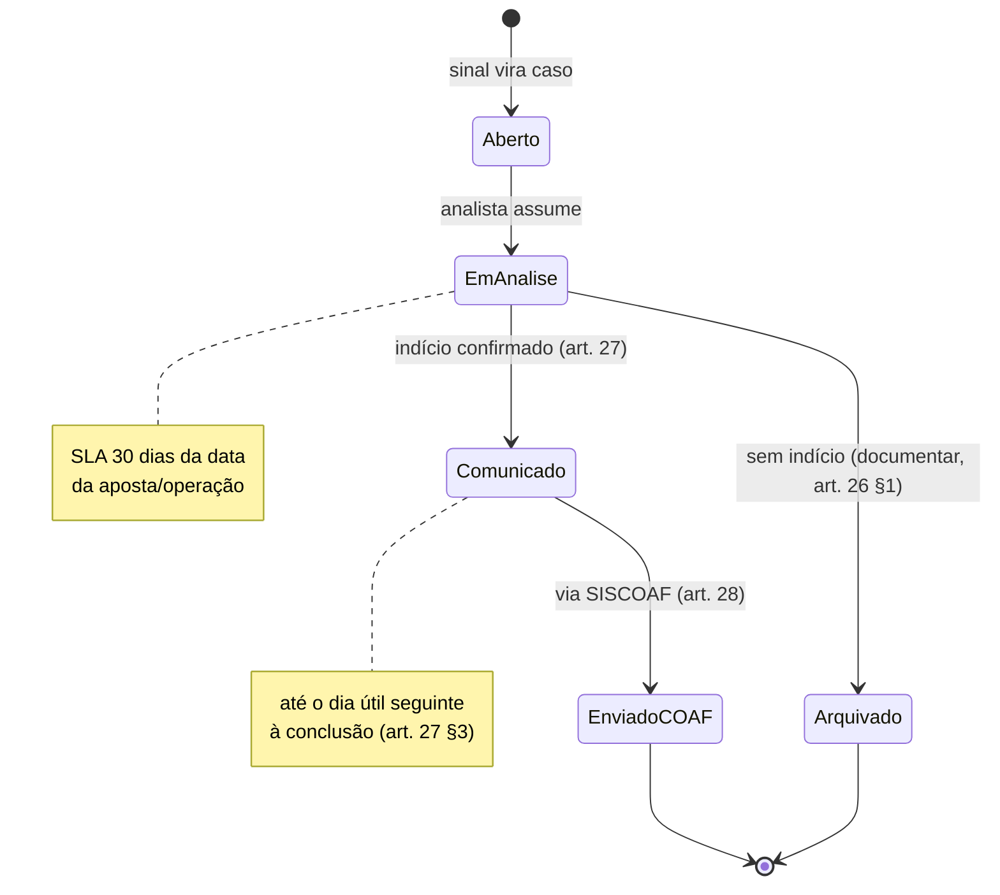
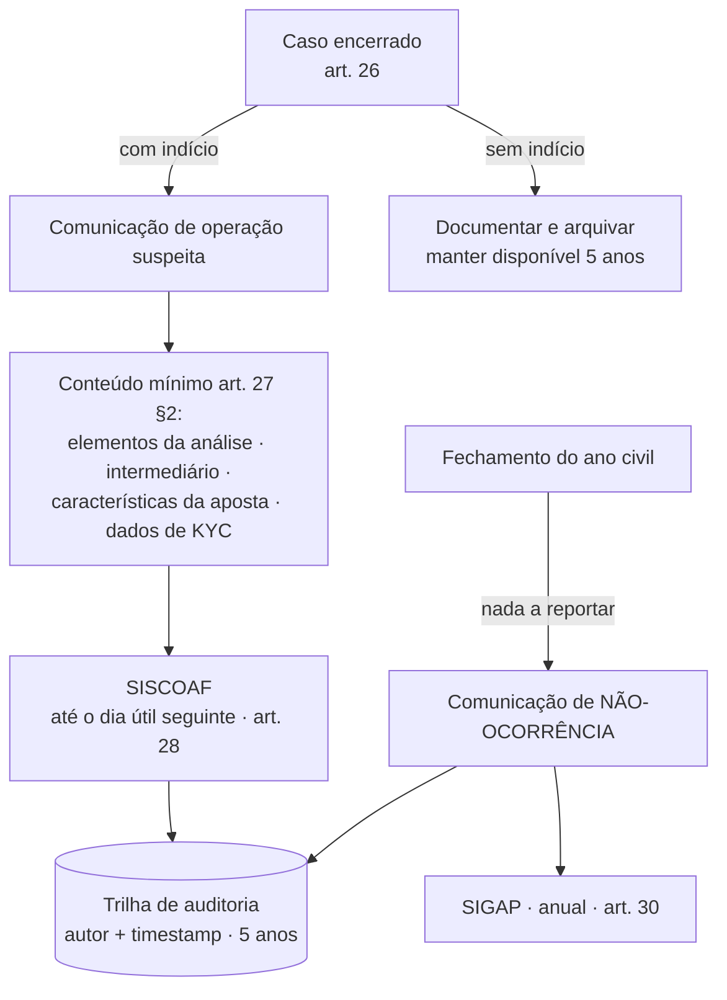

# Product Briefing — Módulo M7 · PLD/AML (Prevenção à Lavagem de Dinheiro)

> **Versão:** 1.0  **Status:** Draft  **Última atualização:** Junho de 2026  **Classificação:** Confidencial

Briefing do módulo M7 do Atlas — a página de **compliance/PLD-FTP** do dashboard, voltada à operação e à tomada de decisão de prevenção à lavagem de dinheiro em apostas de quota fixa. Consolida a pesquisa regulatória profunda (norma artigo-a-artigo, operação SISCOAF/COAF e benchmarks GAFI/RegTech) no padrão de briefing Atlas.

---

## 1. Registro de versões

| Versão | Data | Alterações |
|---|---|---|
| 1.0 | jun/2026 | Versão inicial do briefing M7, a partir da pesquisa profunda da Portaria SPA/MF 1.143/2024 (texto integral, 37 artigos), IN MF/SPA 4/2024, Lei 9.613/1998 (art. 12) e benchmarks GAFI/FATF. |

---

## 2. Base regulatória (fundação do módulo)

O M7 implementa, em produto, os deveres de PLD/FTP impostos aos **agentes operadores de apostas de quota fixa**. A norma central é a **Portaria SPA/MF nº 1.143/2024** (texto integral consultado), que detalha os deveres dos arts. 10, 11 e 12 da **Lei nº 9.613/1998** para o setor.

| Norma | Papel |
|---|---|
| **Lei nº 9.613/1998** | Lei de lavagem de dinheiro. Deveres das pessoas obrigadas (arts. 10–11) e sanções (art. 12). |
| **Lei nº 14.790/2023** + **Lei nº 13.756/2018** | Marco legal das apostas de quota fixa. Art. 26 da 14.790: impedidos de apostar. |
| **Portaria SPA/MF nº 1.143/2024** | Regulamento PLD/FTP do setor de apostas — políticas, KYC, monitoramento, comunicação ao COAF, guarda. Vigente desde a publicação (12/07/2024); fiscalização e sanção desde **1º/jan/2025** (art. 36). |
| **IN MF/SPA nº 4/2024** | Habilitação do operador no SISCOAF e operacionalização das comunicações + não-ocorrência. |
| **Lei nº 13.810/2019** | Indisponibilidade de ativos por determinação do CSNU/ONU (sanções). |
| **Lei nº 13.260/2016** | Financiamento do terrorismo. |
| **Lei nº 14.597/2023 (Lei Geral do Esporte), art. 177** | Manipulação de resultados (match-fixing) como gatilho de suspeição. |

> ⚠️ **Correção herdada do M9:** para apostas **não existe valor mínimo (threshold fixo)** para comunicação automática ao COAF. A obrigação é **baseada em risco/suspeição** (art. 27). O "R$ 2.000" que apareceu no rascunho do M9 **não se aplica** como regra automática aqui.

> 📌 **Dúvida em aberto (verificar):** desde 2025 a Secretaria vem editando portarias complementares e houve reorganização administrativa do regulador. O **arcabouço material** da 1.143/2024 segue operante, mas a numeração/consolidação vigente deve ser confirmada na página de legislação da SPA antes de fechar requisitos de UI legalmente sensíveis.

---

## 3. Visão do módulo

**Descrição.** O M7 é a página de **prevenção à lavagem de dinheiro e ao financiamento do terrorismo (PLD/FTP)** do Atlas. Ele transforma o fluxo de apostas e operações associadas em sinais de risco monitoráveis, organiza casos em uma fila de análise auditável, e instrumenta as comunicações ao COAF e a comunicação de não-ocorrência — tudo com trilha de auditoria e retenção de 5 anos. Posicionamento: **compliance e investigação**, não marketing (coerente com a estratégia Atlas).

**Personas.** Analista de PLD/AML, Encarregado/Diretor de Compliance (responsável administrativo nos termos do art. 12 da Lei 9.613/1998), Auditoria interna, Diretoria (visão de risco agregado).

**Fonte de dados.** `ClickHouse (≤ 90 dias, quente)` para alertas e monitoramento operacional · `BigQuery (> 90 dias, frio)` para casos encerrados, comunicações e **trilha de auditoria de 5 anos**.

**Disponível em.** MVP (KPIs + monitoramento de sinais + fila de casos + registro de comunicações) · H1 (score PLD calibrado, integração SISCOAF/SIGAP, grafo de vínculos completo) · H2 (modelos preditivos, automação de não-ocorrência, tipologias GAFI avançadas).

**Reaproveitamento (M4/M9).** Score PLD (dimensão 3 do Score Engine), grafo de vínculos, `PldHistogram`, `PldScatter`, alertas e trilha auditável já existentes no M4; filtro em linguagem natural do M9 para isolar coortes de PLD.

---

## 4. Mapa regulatório → função do módulo (artigo-a-artigo)

A tabela abaixo é o coração do briefing: cada dispositivo da Portaria 1.143/2024 vira uma capacidade verificável da página.

| Dispositivo | Exige | Vira no M7 |
|---|---|---|
| **Art. 4** | Habilitação no SISCOAF | Estado de integração SISCOAF (conectado/pendente) no header de compliance |
| **Art. 7–9, 12–13** | Políticas, procedimentos e controles documentados, aprovados e **atualizados anualmente** | Repositório de políticas versionadas + status "atualizada no ano" |
| **Art. 11** | Relatório anual à SPA **até 1º de fevereiro** do ano subsequente | Lembrete/checklist de obrigação anual + export do relatório de boas práticas |
| **Art. 14** | **Avaliação interna de risco anual** + matriz de risco (prob. × impacto financeiro/jurídico/reputacional/socioambiental); categorias com medidas reforçadas/simplificadas | Módulo de Avaliação de Risco: matriz/heatmap, categorias, documentação dos riscos mensurados |
| **Art. 15–20** | KYC: identificar, qualificar e **classificar risco** de apostadores; bloquear impedidos (art. 26 Lei 14.790); checar **PEP** (familiar 2º grau/representante/colaborador; condição perdura 5 anos); compatibilidade econômico-financeira; manual anual | Painel KYC: status de verificação, flag PEP, classe de risco (baixo/médio/alto), revisão por mudança de perfil |
| **Art. 21–22** | Conhecer funcionários/parceiros/terceiros; guarda ≥ 5 anos do término do vínculo | (Fora do core de produto; tratado como cadastro/RH com retenção) |
| **Art. 23–25** | Monitorar, selecionar e analisar apostas/operações; **19 sinais de atenção** (art. 25, I–XIX) | Motor de sinais de risco (ver §6) — o coração da página |
| **Art. 26** | Documentar análise; **prazo de 30 dias** para encerrar, contado da data da aposta/operação | SLA de 30 dias por caso, com contador e registro da conclusão |
| **Art. 27** | Comunicar ao COAF após análise; conteúdo mínimo (elementos, intermediário, características, dados de KYC); **até o dia útil seguinte** à conclusão | Geração da comunicação com campos obrigatórios pré-preenchidos a partir do caso |
| **Art. 28** | Comunicar **via SISCOAF** | Fluxo de envio/registro SISCOAF |
| **Art. 29** | **Sigilo (anti-tipping-off)**: proibido informar o apostador/terceiros sobre a comunicação | RBAC restritivo + ocultação de comunicações fora do círculo de compliance |
| **Art. 30** | **Comunicação de não-ocorrência anual** (quando nada a reportar) via **SIGAP** | Workflow de não-ocorrência com status do ano |
| **Art. 31** | Cumprir **sem demora** indisponibilidade de ativos do CSNU/ONU; monitorar listas | Triagem contra listas de sanções ONU + ação de bloqueio |
| **Art. 32** | **Guarda de registros ≥ 5 anos** | Retenção em camada fria (BigQuery) + trilha auditável |
| **Art. 33** | Atender requisições do COAF | Export auditável sob demanda |
| **Art. 34 + Lei 9.613 art. 12** | Sanções por descumprimento (ver §11) | Justificativa de risco/ROI do módulo |

---

## 5. KPIs de cabeçalho

Os números que o compliance vê primeiro:

- **Alertas PLD abertos** (var. D/D) — sinais gerados ainda não triados.
- **Casos em análise** (var. D/D) — e quantos **com SLA estourando** (> 30 dias, art. 26 §2).
- **Comunicações ao COAF** no período — enviadas / pendentes.
- **Não-ocorrência** — status do ano civil corrente (pendente/enviada).
- **% de clientes classificados por risco** — cobertura de KYC (art. 18).
- **Clientes PEP ativos** e **% com due diligence reforçada**.
- **Hits em listas de sanções (ONU)** — abertos / resolvidos.

---

## 6. Motor de sinais de risco (art. 25, I–XIX)

Cada inciso do art. 25 vira um detector com `score_factors` para **explicabilidade** (gate do produto). Os principais mapeiam diretamente para componentes que já temos:

| Sinal (art. 25) | Descrição | Detector / componente |
|---|---|---|
| XI | Aporte/retirada em curto tempo → fracionamento | **Estruturação/smurfing** — `PldHistogram` (faixas de valor) |
| XII | Saque logo após depósito **sem aposta** | **Pass-through / descasamento dep↔saque** — `PldScatter` |
| X | Movimentação atípica sugerindo ferramenta automatizada | **Velocidade/automação** (bot detection) |
| XIII–XV | Uso de conta por terceiro / intermediador / laranja | **Grafo de vínculos** (contas conectadas) |
| XVI | Conluio em bolsa de apostas (apostas opostas p/ transferir valor) | **Arbitragem/conluio** — grafo + odds |
| III | Jurisdição GAFI de alto risco / tributação favorecida | **Geo-risk flag** |
| IX | Incompatibilidade com perfil/ocupação/situação financeira | **Desvio de perfil** (KYC vs. operação) |
| XVII | Contas de PEP | **Flag PEP** |
| XVIII | Dificuldade de coletar/validar cadastro | **KYC fail** |
| VI–VIII | Origem suspeita / prêmio suspeito / **manipulação de resultados** (match-fixing) | Flags de origem e integridade esportiva |
| I–II, IV–V | Pessoa suspeita de LD/terrorismo; resistência; info falsa | Flags de conduta/listas |

Saída: **ranking de apostadores/operações sinalizadas**, cada linha com os motivadores (Explainable AI), pronta para virar caso.

---

## 7. Workflow de casos (fila de análise)

Estados auditáveis, com responsável, SLA de 30 dias (art. 26 §2) e histórico imutável:



---

## 8. Comunicações COAF/SISCOAF e não-ocorrência

Dois fluxos distintos — não confundir os canais:



- **Suspeita** → SISCOAF (art. 28), até o **dia útil seguinte** à conclusão da análise (art. 27 §3).
- **Não-ocorrência** → SIGAP (art. 30), anual, quando nada houve a reportar no ano civil.
- **Sigilo (art. 29):** proibido compartilhar a existência da comunicação com o apostador ou terceiros — só COAF e SPA. Reflete em RBAC.

---

## 9. KYC, PEP, listas e sanções ONU

- **Identificação/qualificação/classificação** (art. 15–18): verificar identidade no cadastro, bloquear impedidos (art. 26 Lei 14.790), avaliar compatibilidade econômico-financeira, classificar em categorias de risco, **rever quando o perfil muda** (art. 19).
- **PEP** (art. 16 §único): flag de PEP, familiares até 2º grau, representantes e colaboradores; **condição perdura por 5 anos** após deixar o cargo → due diligence reforçada.
- **Listas de sanções (art. 31 + Lei 13.810/2019):** triagem contra listas do CSNU/ONU; **indisponibilidade de ativos sem demora** quando há designação; monitoramento contínuo das listas.

---

## 10. Trilha de auditoria e guarda (art. 32)

Tudo logado — alerta, análise, decisão, comunicação — com **autor + timestamp**, imutável, retido por **≥ 5 anos** em camada fria. Export auditável para atender requisições do COAF (art. 33) e da SPA. A análise deve ficar documentada e disponível **mesmo quando não gera comunicação** (art. 26 §1).

---

## 11. Conformidade e sanções (justificativa de risco)

Descumprir os deveres sujeita operador **e administradores** (art. 34 da Portaria → art. 12 da Lei 9.613/1998) a:

| Sanção | Detalhe |
|---|---|
| Advertência | Irregularidade no cumprimento |
| **Multa** | de 1% até o **dobro do valor da operação**, **ou** até **200% do lucro** obtido/presumido, **ou** até **R$ 20.000.000** |
| Inabilitação temporária | Para administradores, em infrações graves ou reincidência |
| Cassação/suspensão | Da autorização para operar, em reincidência específica |

Fiscalização e sanção em vigor **desde 1º/jan/2025** (art. 36). Isso ancora o ROI do M7: o módulo é o controle que evita exposição material e reputacional.

---

## 12. Score PLD e fórmulas

O **Score PLD** é a dimensão 3 do Score Engine do M4. Composição proposta (a calibrar):

```
Score_PLD = Σ (peso_i × sinal_i normalizado 0–100)
```

onde cada `sinal_i` vem do motor do §6 (estruturação, pass-through, automação, vínculos, geo-risk, desvio de perfil, PEP, KYC fail). Cada caso carrega `score_factors` — a decomposição que tornou o score auditável e explicável (gate obrigatório). **Pesos e thresholds de corte ficam como item de calibração** (ver §14).

---

## 13. Personas × módulo × RBAC

| Persona | Jobs to be done | Módulos | Role RBAC |
|---|---|---|---|
| Analista PLD/AML | Triar alertas, conduzir casos, redigir comunicação | M7 (operação) | `compliance_analyst` |
| Encarregado/Diretor de Compliance | Aprovar comunicações, gerir matriz de risco, responder à SPA | M7 + Avaliação de Risco | `compliance_admin` |
| Auditoria interna | Revisar trilha, validar SLA e retenção | M7 (somente leitura) | `auditor` (read-only) |
| Diretoria | Ver risco agregado e obrigações do ano | M7 (KPIs) | `exec_viewer` |

O **sigilo do art. 29** exige que comunicações ao COAF fiquem restritas ao círculo de compliance — RBAC nega visibilidade a perfis de marketing/operação.

---

## 14. Benchmark GAFI/FATF e RegTech

O desenho dos sinais está alinhado às tipologias do **GAFI/FATF** ("Vulnerabilities of Casinos and Gaming Sector") e a indicadores de autoridades (ex.: FID/Letônia): fundos parados em conta e depois sacados sem jogo, depósitos grandes com mínima atividade de aposta, uso de mulas/intermediários, e jurisdições de alto risco.

Abordagem técnica de mercado (RegTech), que o M7 adota em camadas:

1. **Rules engine** — thresholds e regras determinísticas (estruturação, saque pós-depósito) → barato e explicável, bom para MVP.
2. **Risk scoring** — score composto por cliente/operação ponderando perfil, padrão transacional e listas externas (multiplicadores para alto risco) → H1.
3. **Link/network analysis** — grafo para mapear contas e intermediários (laranjas, conluio em bet exchange) → H1.
4. **AI/pattern recognition** — detecção de smurfing entre contas não óbvias e tipologias avançadas → H2.

---

## 15. Dúvidas em aberto

- **Numeração/consolidação vigente:** confirmar na página de legislação da SPA se a 1.143/2024 segue como texto-base ou foi reconsolidada por portaria posterior — o arcabouço material vale; a referência formal precisa ser checada antes do go-live.
- **Pesos e thresholds do Score PLD:** calibração com dados reais — quem define e valida.
- **Canal de não-ocorrência:** confirmar se SIGAP segue como canal (art. 30 prevê "outro canal" que a SPA pode criar/informar).
- **Integração SISCOAF:** API vs. envio manual assistido no MVP.
- **Retenção:** 5 anos é piso; definir política de expurgo e custo de armazenamento frio.

---

## 16. Fora de escopo

- **Decisão jurídica final de comunicar:** o M7 instrui e pré-preenche, mas a decisão e a responsabilidade são do compliance humano (art. 12).
- **Cadastro de funcionários/terceiros (art. 21–22):** tratado fora do produto (RH/cadastro), apenas com a regra de retenção.
- **Onboarding/KYC de identidade biométrica:** consumido de provedor externo; o M7 exibe o status, não executa a verificação.
- **Marketing/CRM sobre coortes PLD:** vedado pelo posicionamento e pelo sigilo do art. 29.

---

## Fontes

- Portaria SPA/MF nº 1.143/2024 — texto integral (37 artigos), versão bilíngue: [advennt.com](https://www.advennt.com/wp-content/uploads/2024/08/MONTGOMERY-Bilingual-dual-column-version-of-SPA-MF-Ordinance-No.-1143-of-11th-July-2024.pdf) · [LegisWeb](https://www.legisweb.com.br/legislacao/?id=461891) · página de legislação da SPA: [gov.br/fazenda](https://www.gov.br/fazenda/pt-br/composicao/orgaos/secretaria-de-premios-e-apostas/apostas-de-quota-fixa/legislacao)
- IN MF/SPA nº 4/2024 (habilitação SISCOAF + não-ocorrência): [LegisWeb](https://www.legisweb.com.br/legislacao/?id=471381)
- Lei nº 9.613/1998, art. 12 (sanções): [COAF/gov.br](https://www.gov.br/coaf/pt-br/assuntos/informacoes-as-pessoas-obrigadas/avisos-e-alertas/alertas-e-orientacoes-do-coaf/sancoes-previstas-na-lei-no-9-613-de-1998) · [BCB](https://www.bcb.gov.br/pre/leisedecretos/port/lei9613.pdf)
- GAFI/FATF — Vulnerabilities of Casinos and Gaming Sector: [fatf-gafi.org](https://www.fatf-gafi.org/content/dam/fatf-gafi/reports/Vulnerabilities%20of%20Casinos%20and%20Gaming%20Sector.pdf.coredownload.pdf) · indicadores no setor de jogos (FID/Letônia): [fid.gov.lv](https://fid.gov.lv/uploads/files/2023/Money%20Laundering%20Indicators%20in%20the%20Gambling%20and%20Lottery%20Organisers%20Sector.pdf)
- Análises setoriais: [Lefosse](https://lefosse.com/noticias/alerta/regulamentacao-de-apostas-esportivas-o-que-diz-a-portaria-spa-no-1-143-2024-sobre-prevencao-a-lavagem-de-dinheiro/) · [Mattos Filho](https://www.mattosfilho.com.br/en/unico/aml-ftp-rules-fixed-odds-betting/) · [Demarest](https://www.demarest.com.br/en/spa-mf-publishes-new-regulations-on-fixed-odds-betting-operations-in-brazil/)
